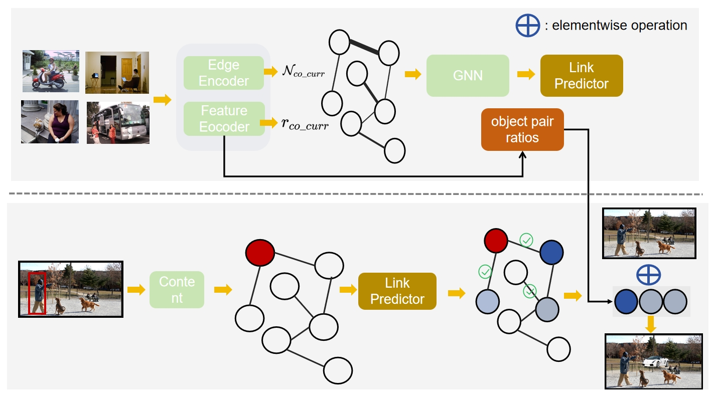
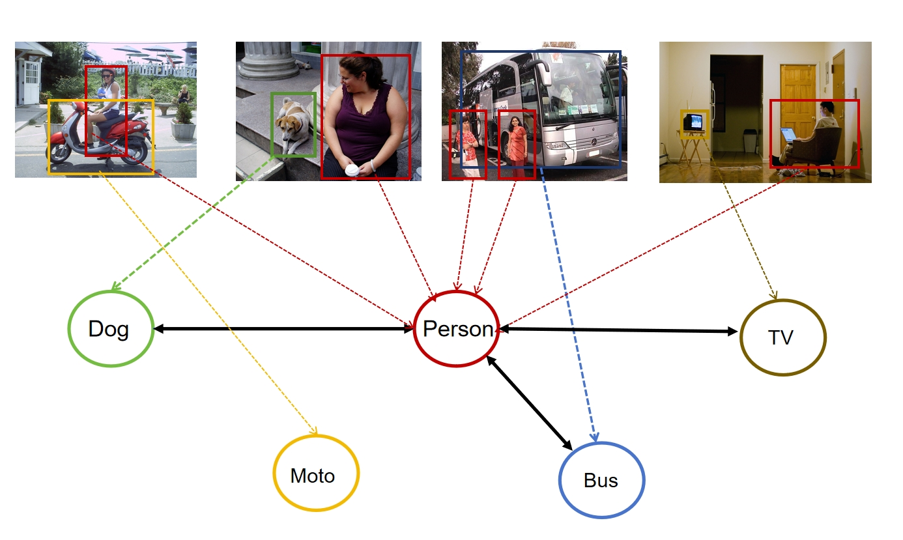

# GNN-Copy-Paste

## Structure
* utils.py: functions to generate edges and encode features
* models.py: GNN models
* train.py: to train the GNN
* gallery: sample images to form the graph
## Pipeline

features of each node: [num_images,[num_target,ratio,pos_x,pos_y,num_objects]]

* **num_images**: Total numbers of images in gallery
* **num_target**: Number of targets in single images
* **ratio: ratio** between bounding box of target object and images
* **pos_x,pox_y**: coordinate of target object
* **number_objects**: all detected objects inside image

Detected objects in the same image will link to each other.

As illustrated in figure above, the co-occur relationship can be
expressed by a graph, the edge represents the co-occur of objects in images,
the node represents the detected object in images. 